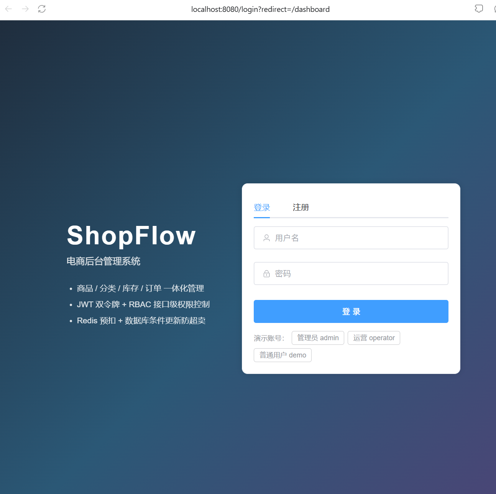
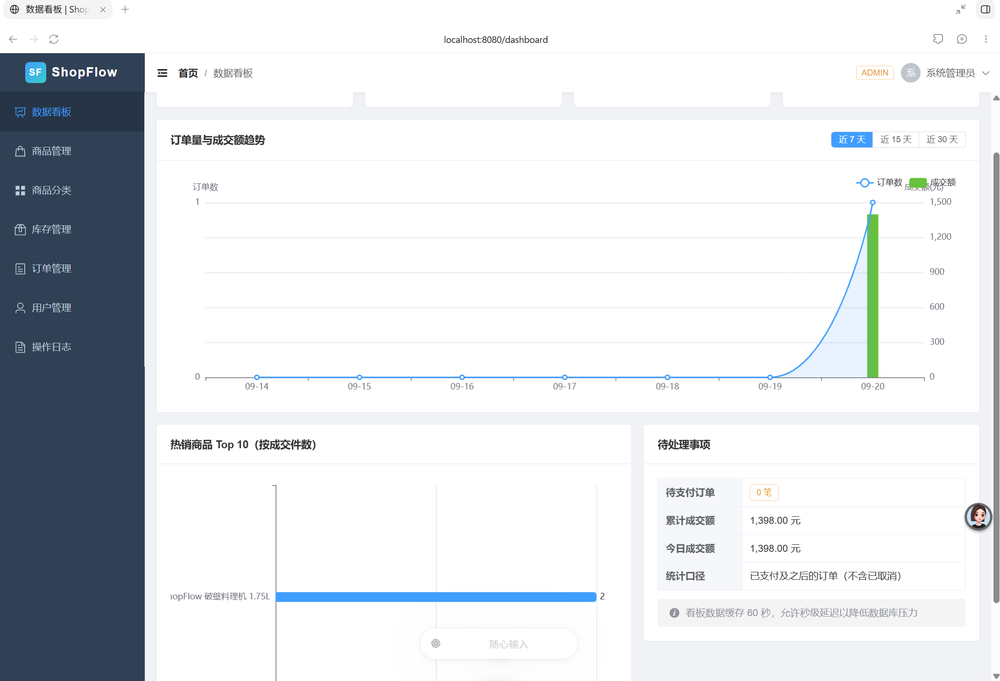
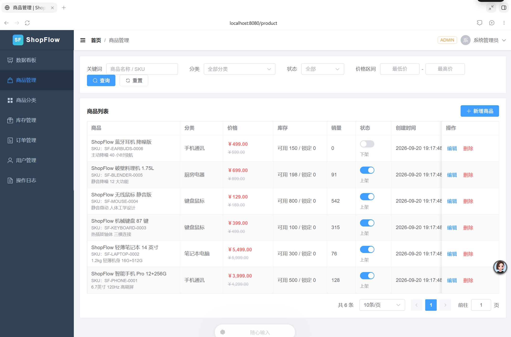
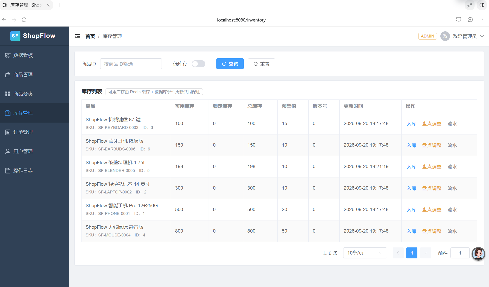
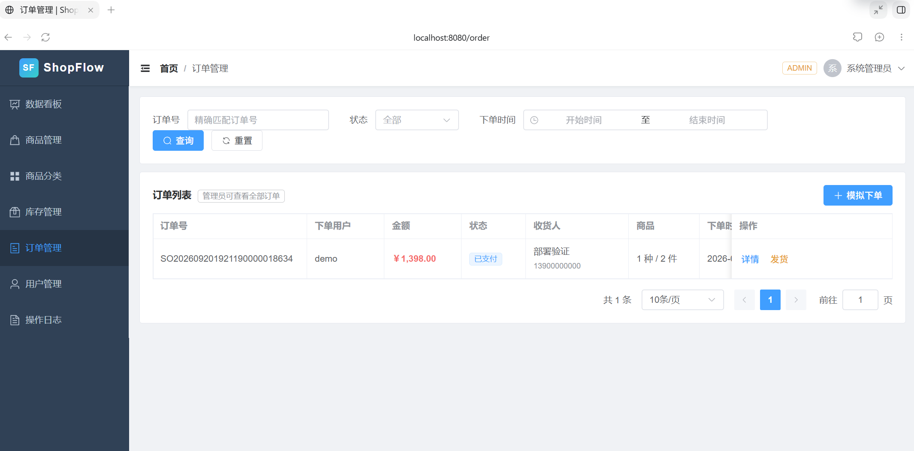
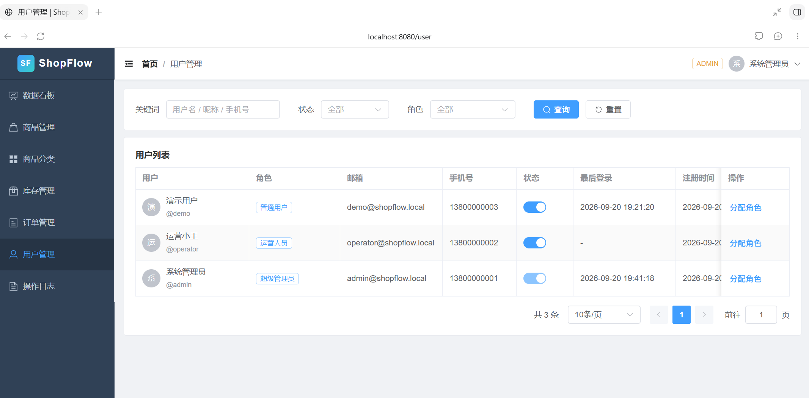
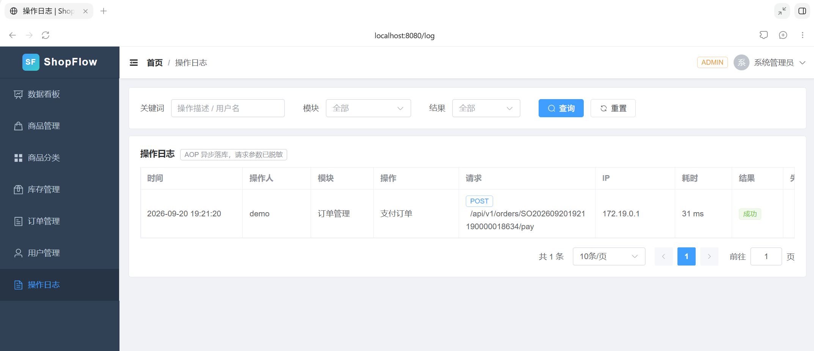
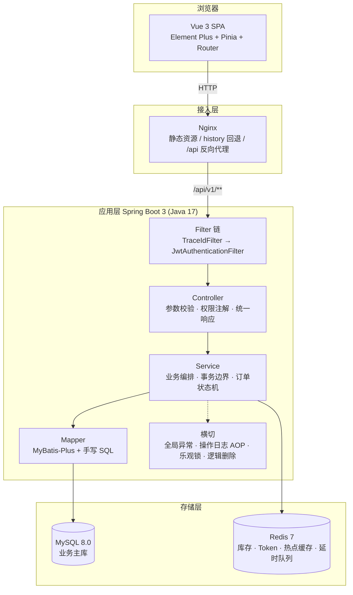
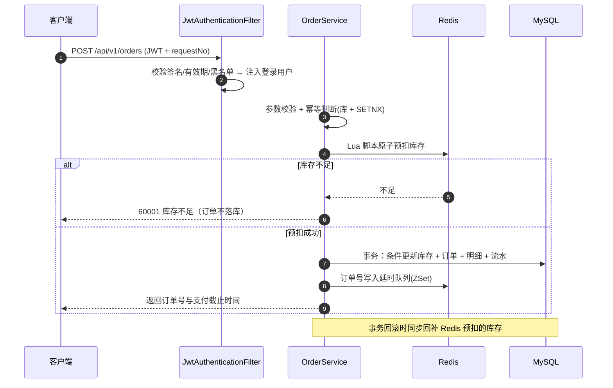
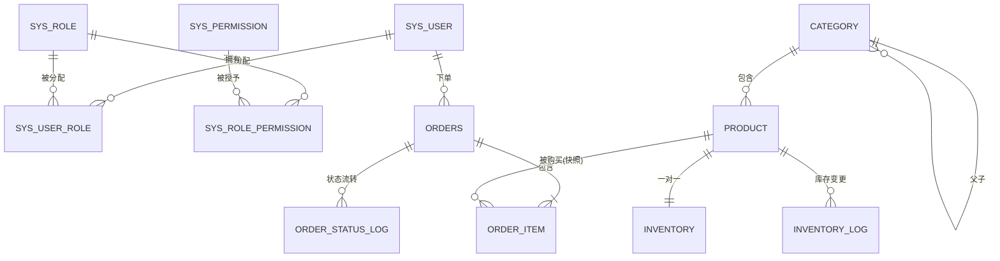

# ShopFlow 电商后台管理系统

一个**前后端分离**的企业级电商后台管理系统，覆盖 `用户权限 → 商品分类 → 商品 → 库存 → 订单 → 数据看板` 的完整业务闭环。

项目不是 CRUD 练习：它把三个真实的工程问题当作核心目标——
**高并发下库存不超卖**、**热点数据读性能**、**订单状态在并发下不出错**，
并且每一项都有可复现的实测数据支撑。

| 维度 | 说明 |
| --- | --- |
| 后端 | Java 17 · Spring Boot 3.2 · Spring MVC · Spring Security · MyBatis-Plus · MySQL 8.0 · Redis 7 · JWT |
| 前端 | Vue 3 · Vite · TypeScript · Element Plus · Pinia · Vue Router · Axios · ECharts |
| 工程能力 | 分层架构 · 全局异常处理 · 参数校验 · RBAC 接口级鉴权 · 统一响应体 · 链路追踪 · 多环境配置 · Docker 部署 |
| 项目规模 | 后端 148 个 Java 文件 · 前端 18 个页面/组件 · 13 张表 · 36 个测试用例 · 约 1.3 万行代码 |

---

## 一、项目亮点（全部有实测数据）

| 亮点 | 做法 | 实测结果 |
| --- | --- | --- |
| **三层防超卖** | Redis Lua 原子预扣 → MySQL 条件更新 `AND available_stock >= n` → 数据库 `CHECK` 约束兜底 | 100 并发抢 100 件库存共 200 次请求：成功 100 笔、失败 100 笔，库存归零、**零负数、零超卖**、无重复订单 |
| **缓存优化** | 商品详情 Cache-Aside + 空值占位 + SETNX 互斥 + TTL 抖动 | 8569 QPS（开缓存）vs 2536 QPS（关缓存），**QPS ×3.4、P95 降低 74%**，缓存命中率 **100%** |
| **性能瓶颈定位** | 通过"并发翻倍吞吐不变"识别串行化，再把流量打散到多商品验证 | 单商品 100 QPS → 4 商品 **293 QPS**，定位为**库存行锁竞争**，不是 CPU/连接池/日志 |
| **深分页优化** | 20 万订单下对比 OFFSET、延迟关联、游标分页 | OFFSET 深分页扫描 10 万行/30.2ms；**游标分页只扫描 10 行/0.053ms（快约 570 倍）** |
| **幂等下单** | Redis SETNX + 数据库 `(user_id, request_no)` 唯一索引双保险 | 重复提交只产生一笔订单；Redis 异常时自动降级，不阻断下单 |
| **订单状态机** | 状态流转规则收敛到单一组件，非法流转统一 40907 | 状态流转规则穷举测试 15 例，重复支付等非法操作被拒绝 |
| **链路可观测** | TraceId 贯穿全链路 + 分级日志 + 操作审计 AOP | 一次请求的所有日志（Controller/SQL/异常）可用一个 traceId 串起来 |
| **一键部署** | 多阶段构建 + docker-compose 编排四服务 | `docker compose up -d --build` 拉起全栈，**四容器全部健康**，重启后数据不丢 |

---

## 二、功能截图

### 登录 / 注册



> 登录页内置三个演示账号，可一键切换角色验证权限差异。
> 页面左侧直接标注了三个技术要点：一体化管理、JWT 双令牌 + RBAC、Redis 预扣 + 数据库条件更新防超卖。

### 数据看板



> 指标卡 + 订单量与成交额趋势（没有订单的日期自动补零）+ 热销商品 Top 10 + 待处理事项。
> 看板数据缓存 60 秒，用秒级延迟换取数据库压力的下降。

### 商品管理



> 关键词 / 分类 / 状态 / 价格区间多条件筛选，列表直接带出分类名与可用库存，
> 低于预警值红色高亮；支持上下架（下架商品不可下单）与逻辑删除。

### 库存管理



> 可用 / 锁定 / 总库存分列展示，并带乐观锁版本号；
> 支持入库、盘点调整，以及按商品查看库存流水（含变更前后值与关联订单号）。

### 订单管理



> 状态标签、金额、收货人、商品件数一屏可见；待支付可支付/取消，已支付可发货，配送中可完成。
> 「模拟下单」按钮可以在后台直接演示完整下单链路（下单 → 库存锁定 → 支付 → 锁定转扣减）。

### 用户与角色



> 用户列表带角色标签与最后登录时间；支持启用/禁用（被禁用账号的令牌立即失效）与角色分配。
> 用 `demo` 账号登录可以看到菜单被裁剪、访问后台接口返回 `403 缺少操作权限`。

### 操作日志



> AOP 异步落库的操作审计：操作人、模块、请求方法与 URI、IP、耗时、结果，
> 请求参数自动脱敏；耗时超过 500ms 的请求会高亮，便于定位慢接口。

<details>
<summary>还可以补充的截图（分类管理、商品表单、订单详情、接口文档）</summary>

按下面的文件名放进 `docs/images/`，并在此处补充图片引用即可：

| 文件名 | 页面 | 截图要点 |
| --- | --- | --- |
| `08-category.png` | 商品分类 | 两级分类树形表格 |
| `09-product-form.png` | 商品编辑弹窗 | 分类级联、价格校验、初始库存 |
| `10-order-detail.png` | 订单详情 | 商品快照明细 + 状态流转时间线 |
| `11-swagger.png` | 接口文档 | OpenAPI 在线调试（dev 环境） |

</details>
---

## 三、技术栈

### 后端

| 技术 | 版本 | 用途 |
| --- | --- | --- |
| Java | 17 | 语言基线（LTS） |
| Spring Boot | 3.2.5 | 应用框架与自动配置 |
| Spring MVC | 6.1 | RESTful 接口 |
| Spring Security | 6.2 | 安全过滤器链、认证上下文 |
| MyBatis-Plus | 3.5.7 | 单表 CRUD、分页、乐观锁、逻辑删除 |
| MySQL | 8.0 | 业务主库（事务、行锁、CHECK 约束） |
| Redis | 7 | 库存预扣、Token 管理、热点缓存、延时队列 |
| JWT (jjwt) | 0.12.5 | 无状态认证（访问令牌 + 刷新令牌） |
| MapStruct | 1.5.5 | 编译期对象转换，无反射开销 |
| springdoc-openapi | 2.5.0 | 接口文档 |
| JUnit 5 / Mockito / Testcontainers | — | 单元测试与容器化集成测试 |

### 前端

| 技术 | 版本 | 用途 |
| --- | --- | --- |
| Vue | 3.5 | 组合式 API |
| TypeScript | 5.6 | 类型约束（构建前强制 `vue-tsc` 检查） |
| Vite | 5.4 | 构建与开发服务器 |
| Element Plus | 2.8 | 后台管理组件库 |
| Pinia | 2.2 | 用户/权限/UI 状态管理 |
| Vue Router | 4.4 | 路由与权限守卫 |
| Axios | 1.7 | 请求封装（Token 注入、401 静默续期） |
| ECharts | 5.5 | 数据看板可视化 |

---

## 四、系统架构



### 下单核心链路


---

## 五、数据库设计

### ER 模型



### 表清单（13 张）

| 分组 | 表 | 说明 |
| --- | --- | --- |
| 用户权限 | `sys_user`、`sys_role`、`sys_permission`、`sys_user_role`、`sys_role_permission` | RBAC，权限粒度到接口 |
| 商品库存 | `category`、`product`、`inventory`、`inventory_log` | 两级分类；商品与库存一对一；库存流水可对账 |
| 订单 | `orders`、`order_item`、`order_status_log` | 订单明细为商品快照；状态流转可追溯 |
| 审计 | `sys_operation_log` | 后台操作审计（AOP 异步落库） |

### 几个关键设计决策

**① 订单明细存商品快照**
`order_item` 冗余 `product_name` / `price` / `sku` / `product_image`，订单详情**不 JOIN 商品表**。
商品改价、改名、下架甚至删除，都不影响历史订单的展示与金额——这是电商领域必须做对、但很容易被忽略的一点。

**② 逻辑删除字段写主键 ID**
`deleted BIGINT`，删除时写入该行主键（`UPDATE product SET deleted = id WHERE id = ?`）。
这样 `UNIQUE KEY (sku, deleted)` 既能约束活跃数据唯一，又能保留历史删除记录；
常见的 `deleted TINYINT(0/1)` 做不到"同一 SKU 被删除两次"。

**③ 库存独立成表**
`inventory` 与 `product` 一对一。库存是高频更新的热点行、商品以读为主，
拆开后锁竞争范围更小，商品查询也不会被库存写操作阻塞。

**④ 库存恒等式与流水**
`total_stock = available_stock + locked_stock`；
下单锁定可用库存、支付扣减锁定与总库存、取消把锁定退回可用；
每次变更写入 `inventory_log`（含变更前后值与关联订单号），支持对账与问题回溯。

**⑤ 状态流转审计**
`order_status_log` 记录每次 `from_status → to_status` 与操作人类型（用户/管理员/系统），
订单生命周期可完整还原。

---

## 六、快速开始

### 方式一：Docker Compose 一键启动（推荐）

```bash
git clone <repository-url>
cd shopflow
cp .env.example .env        # 可按需修改端口与密码
docker compose up -d --build
```

启动完成后访问：

| 入口 | 地址 |
| --- | --- |
| 前端 | http://localhost:8080 |
| 后端接口（调试用） | http://localhost:18080 |
| MySQL | localhost:13306 |
| Redis | localhost:16379 |

MySQL 首次启动会**自动执行建表脚本与初始化数据**，无需手动导入。

常用命令：

```bash
docker compose ps                  # 查看容器与健康状态
docker compose logs -f api         # 查看后端日志
docker compose down                # 停止（保留数据）
docker compose down -v             # 停止并清空数据卷
```

### 方式二：本地开发

```bash
# 1. 准备 MySQL 8 与 Redis 7，并初始化数据库
mysql -uroot -p < shopflow-backend/src/main/resources/db/schema.sql
mysql -uroot -p < shopflow-backend/src/main/resources/db/data.sql

# 2. 启动后端（默认 dev 环境，端口 8080）
cd shopflow-backend
mvn spring-boot:run

# 3. 启动前端（端口 5173，已配置代理到后端）
cd ../shopflow-web
npm install
npm run dev
```

### 演示账号

| 账号 | 密码 | 角色 | 权限范围 |
| --- | --- | --- | --- |
| `admin` | `Admin@123456` | ADMIN | 全部 17 项权限 |
| `operator` | `Operator@123456` | OPERATOR | 分类/商品/库存/订单/看板 |
| `demo` | `User@123456` | USER | 仅商品查看与自己的订单 |

> 三个账号的密码密文均由 `BCryptPasswordEncoder` 真实生成并校验通过。
> 用 `demo` 登录可以直观看到**菜单被裁剪**、访问后台接口返回 `403 缺少操作权限`。

---

## 七、API 说明

### 统一响应体

```json
{
  "code": 200,
  "message": "success",
  "data": {},
  "traceId": "9f2c1b7ad3e14f0e",
  "timestamp": 1758345600000
}
```

- `code`：业务状态码，`200` 表示成功；`traceId` 可用来定位服务端日志；
- 分页统一返回 `{ records, total, pageNum, pageSize, pages }`；
- HTTP 状态码与业务语义对应：400 参数、401 认证、403 权限、404 资源、409 冲突、500 系统。

### 错误码规范

| 区间 | 含义 | 示例 |
| --- | --- | --- |
| 400xx | 参数校验失败 | 40001 参数缺失、40002 参数不合法 |
| 401xx | 未认证 | 40101 未携带令牌、40102 令牌过期、40103 令牌非法 |
| 403xx | 无权限 | 40301 权限不足、40302 账号被禁用 |
| 404xx | 资源不存在 | 40404 商品不存在、40406 订单不存在 |
| 409xx | 状态冲突 | 40904 SKU 已存在、40907 订单状态不允许该操作 |
| 600xx | 业务规则不满足 | 60001 库存不足、60002 商品已下架 |

### 主要接口

| 模块 | 方法与路径 | 说明 | 所需权限 |
| --- | --- | --- | --- |
| 认证 | `POST /api/v1/auth/register` | 注册 | 匿名 |
| | `POST /api/v1/auth/login` | 登录（返回双令牌） | 匿名 |
| | `POST /api/v1/auth/refresh` | 刷新访问令牌 | 匿名 |
| | `POST /api/v1/auth/logout` | 登出（令牌入黑名单） | 登录 |
| | `GET /api/v1/auth/me` | 当前用户与权限 | 登录 |
| 分类 | `GET /api/v1/categories` | 分类树（Redis 缓存） | `category:read` |
| | `POST/PUT/DELETE /api/v1/categories[/{id}]` | 分类增删改 | `category:create/update/delete` |
| 商品 | `GET /api/v1/products` | 多条件分页（关键词/分类/状态/价格/排序） | `product:read` |
| | `GET /api/v1/products/{id}` | 商品详情（走缓存） | `product:read` |
| | `POST/PUT/DELETE /api/v1/products[/{id}]` | 商品增删改 | `product:create/update/delete` |
| | `PATCH /api/v1/products/{id}/status` | 上下架 | `product:update` |
| 库存 | `GET /api/v1/inventories/{productId}` | 查询库存（含缓存标记） | `inventory:read` |
| | `POST /api/v1/inventories/{productId}/inbound` | 入库 | `inventory:update` |
| | `POST /api/v1/inventories/{productId}/adjust` | 盘点调整 | `inventory:update` |
| | `GET /api/v1/inventories/{productId}/logs` | 库存流水 | `inventory:read` |
| 订单 | `POST /api/v1/orders` | 创建订单（幂等 + 预扣库存） | 登录 |
| | `GET /api/v1/orders` | 订单分页（用户仅自己/管理员全部） | 登录 |
| | `GET /api/v1/orders/{orderNo}` | 订单详情（快照明细 + 状态时间线） | 登录 + 归属校验 |
| | `POST /api/v1/orders/{orderNo}/pay` | 模拟支付 | 登录 + 归属校验 |
| | `POST /api/v1/orders/{orderNo}/cancel` | 取消订单 | 登录 + 归属校验 |
| | `PATCH /api/v1/orders/{orderNo}/status` | 后台发货/完成 | `order:update` |
| 看板 | `GET /api/v1/admin/dashboard/overview` | 核心指标 | `dashboard:read` |
| | `GET /api/v1/admin/dashboard/trend?days=7` | 趋势（缺失日期补零） | `dashboard:read` |
| | `GET /api/v1/admin/dashboard/top-products?limit=10` | 热销排行 | `dashboard:read` |
| 用户 | `GET /api/v1/admin/users` | 用户分页 | `user:read` |
| | `PATCH /api/v1/admin/users/{id}/status` | 启用/禁用 | `user:update` |
| | `PUT /api/v1/admin/users/{id}/roles` | 分配角色 | `user:assign-role` |
| 日志 | `GET /api/v1/admin/operation-logs` | 操作日志 | `log:read` |

dev 环境可访问 `http://localhost:8080/swagger-ui/index.html` 在线调试（生产环境已关闭）。
---

## 八、关键实现

### 1. 三层防超卖

**第一层：Redis Lua 原子预扣**——把"读库存 → 判断 → 扣减"放进一次脚本执行，天然无竞态：

```lua
-- resources/lua/stock_lock.lua
local stock = redis.call('GET', KEYS[1])
if not stock then return -1 end                 -- 缓存未命中，回源预热
if tonumber(stock) < tonumber(ARGV[1]) then
    return 0                                    -- 库存不足
end
redis.call('DECRBY', KEYS[1], ARGV[1])
return 1                                        -- 预扣成功
```

**第二层：MySQL 条件更新**——把业务规则写进 `WHERE`，由行锁保证最终正确性：

```sql
UPDATE inventory
SET available_stock = available_stock - #{quantity},
    locked_stock    = locked_stock + #{quantity}
WHERE product_id = #{productId} AND available_stock >= #{quantity}
```

影响行数为 0 即代表库存不足，业务层据此抛出 `60001` 并回滚事务。

**第三层：数据库约束与流水**——`CHECK (available_stock >= 0)` 兜底，`inventory_log` 支持对账。

> 即使 Redis 被清空、预热错误或服务重启，数据库也不会出现负库存。

### 2. 商品缓存的三个防护

```java
// 缓存穿透：对不存在的 ID 缓存空值占位（TTL 5min）
if (product == null) { cacheNullPlaceholder(id); throw new BizException(PRODUCT_NOT_FOUND); }

// 缓存击穿：回源时用 Redis 分布式锁互斥，未抢到锁的请求短暂轮询等待，避免热点 key 失效瞬间打爆数据库
boolean locked = tryLock(lockKey, lockToken);
try {
    if (locked) { /* 双重检查 → 回源 → 回填缓存 */ }
    else { /* 轮询等待持有者回填，超时后兜底回源 */ }
} finally { if (locked) releaseLock(lockKey, lockToken); }

// 缓存雪崩：TTL 加随机抖动
long ttl = DETAIL_CACHE_TTL.toSeconds() + random.nextInt(300);
```

写操作后删除缓存，并在**事务提交后**再删一次（延迟双删），避免"删缓存 → 并发请求回源旧值 → 回填脏缓存"的窗口。

### 3. 幂等下单

```java
// 先查库（上次可能已成功），再用 SETNX 拦住并发重复提交
Orders duplicated = findByIdempotentKey(userId, dto.getRequestNo());
if (duplicated != null) return buildCreateVO(duplicated);

Boolean first = trySetIdempotentKey(idempotentKey);   // Redis 异常时返回 null → 降级
if (Boolean.FALSE.equals(first)) { /* 取回已存在订单或抛 60005 重复提交 */ }
```

Redis 抖动时自动降级，由数据库 `UNIQUE KEY (user_id, request_no)` 兜底，**不让缓存故障阻断下单**。

### 4. 事务回滚要回补缓存

下单失败回滚时，数据库库存恢复了，但 Redis 里已经扣掉的部分必须还回去，否则会变成卖不掉的"幽灵库存"：

```java
TransactionSynchronizationManager.registerSynchronization(new TransactionSynchronization() {
    @Override public void afterCompletion(int status) {
        if (status == TransactionSynchronization.STATUS_ROLLED_BACK) {
            lockedItems.forEach(item -> inventoryService.releaseStock(...));
        }
    }
});
```

### 5. 接口级权限与越权防护

```java
@RequirePermission("product:create")          // AOP 校验权限码，权限来自库 + Redis 缓存
@OperationLog(module = "商品管理", operation = "新增商品")   // 异步写审计日志，参数自动脱敏
@PostMapping
public R<Long> create(@RequestBody @Valid ProductSaveDTO dto) { ... }
```

```java
// 订单接口额外做数据归属校验，防止水平越权（用户只能操作自己的订单）
private void assertCanAccess(Orders order) {
    LoginUser loginUser = requireLogin();
    if (loginUser.isAdmin()) return;
    if (!loginUser.getUserId().equals(order.getUserId())) throw new BizException(FORBIDDEN, "无权访问该订单");
}
```

### 6. 订单状态机

状态流转规则收敛到 `OrderStatusMachine` 一处，业务代码不再散落 if-else：

```java
PENDING_PAYMENT → PAID | CANCELED
PAID            → DELIVERING
DELIVERING      → COMPLETED
COMPLETED / CANCELED → 终态，不可再流转
```

状态更新使用**带原状态的条件更新**，避免并发下用旧状态覆盖新状态：

```java
orderMapper.update(update, Wrappers.lambdaUpdate(Orders.class)
        .eq(Orders::getId, orderId)
        .eq(Orders::getStatus, fromStatus.getCode()));
```

---

## 九、性能数据（实测）

| 场景 | 指标 | 结果 |
| --- | --- | --- |
| 商品详情（缓存开） | QPS / P95 | 8,569 / 13.3ms |
| 商品详情（缓存关） | QPS / P95 | 2,536 / 52.6ms |
| 缓存命中率 | hit / miss | 122,230 / 0（100%） |
| 100 并发抢 100 件库存 | 超卖次数 | **0** |
| 下单（单商品热点行） | QPS | 100.2 |
| 下单（4 商品打散） | QPS | **293.1** |
| 深分页（OFFSET 10 万） | 扫描行数 / 耗时 | 100,010 行 / 30.2ms |
| 深分页（游标分页） | 扫描行数 / 耗时 | **10 行 / 0.053ms** |

完整测试方法、原始输出与瓶颈分析见 [性能优化与压测报告](docs/03-性能优化与压测报告.md)。

压测工具是项目自带的，不依赖 JMeter/wrk：

```bash
java tools/loadtest/LoadTest.java product http://localhost:8080 admin Admin@123456 50 1 20
java tools/loadtest/LoadTest.java order   http://localhost:8080 demo  User@123456   100 1000 2,3,4,5 1
```

---

## 十、项目结构

```text
shopflow/
├── shopflow-backend/                    # 后端服务
│   ├── src/main/java/com/shopflow/
│   │   ├── controller/                  # 接口层：参数接收、校验、权限注解
│   │   ├── service/ + service/impl/     # 业务层：事务边界、业务编排
│   │   ├── mapper/                      # 持久层：MyBatis-Plus + 自定义 SQL
│   │   ├── entity/ dto/ vo/             # 三态模型隔离（数据库 / 入参 / 出参）
│   │   ├── convert/                     # MapStruct 对象转换（编译期生成）
│   │   ├── security/                    # JWT、权限注解、登录上下文
│   │   ├── aspect/                      # 权限校验与操作日志切面
│   │   ├── config/                      # 安全、缓存、ORM、文档等配置
│   │   ├── exception/                   # 业务异常与全局异常处理
│   │   ├── task/                        # 超时关单定时任务
│   │   └── common/                      # 统一响应、错误码、枚举、工具
│   ├── src/main/resources/
│   │   ├── db/                          # schema.sql / data.sql
│   │   ├── lua/                         # 库存预扣、释放、分布式锁脚本
│   │   ├── mapper/                      # 复杂查询 XML
│   │   └── application*.yml             # 多环境配置
│   └── Dockerfile                       # 多阶段构建
├── shopflow-web/                        # 前端工程
│   ├── src/api/                         # 按模块拆分的接口定义
│   ├── src/utils/request.ts             # Axios 封装（Token、401 静默续期）
│   ├── src/stores/                      # Pinia：用户 / 权限 / UI
│   ├── src/router/                      # 路由表与权限守卫
│   ├── src/layout/                      # 后台布局：侧边栏、导航栏
│   ├── src/views/                       # 业务页面
│   └── Dockerfile + nginx.conf          # 构建 → Nginx 托管
├── tools/loadtest/                      # 自研压测工具
├── docs/                                # 设计、验证、压测、部署文档
└── docker-compose.yml                   # 全栈一键部署
```

---

## 十一、测试

```bash
cd shopflow-backend
mvn test
```

```text
Tests run: 36, Failures: 0, Errors: 0, Skipped: 3
```

| 测试类 | 用例数 | 覆盖内容 |
| --- | --- | --- |
| `RTest` | 7 | 统一响应体、分页边界（总页数向上取整、每页为 0 时兜底） |
| `OrderStatusTest` | 15 | 状态机合法/非法流转穷举、终态判定、状态码解析 |
| `JwtTokenProviderTest` | 6 | 载荷解析、令牌类型隔离、jti 唯一、篡改拒绝、过期识别、弱密钥快速失败 |
| `ShopFlowApplicationTests` | 5 | 上下文加载、匿名白名单、401/405 统一结构、TraceId 透传 |
| `OrderConcurrencyTest` | 3 | **200 并发抢 100 件库存的防超卖断言**、幂等重复下单、库存不足回滚（Testcontainers，无 Docker 环境自动跳过） |

---

## 十二、文档索引

| 文档 | 内容 |
| --- | --- |
| [需求分析与系统设计](docs/01-需求分析与系统设计.md) | 需求拆解、系统架构、技术选型、完整 ER 与建表 SQL、API 设计、开发计划 |
| [后端开发与验证记录](docs/02-后端开发与验证记录.md) | 交付内容、真实 MySQL/Redis 端到端验证证据、缺陷修复记录 |
| [性能优化与压测报告](docs/03-性能优化与压测报告.md) | 缓存收益、防超卖验证、瓶颈定位、深分页对比、待优化清单 |
| [容器化部署与验证记录](docs/04-容器化部署与验证记录.md) | 编排设计、部署验证结果、两个部署期缺陷的定位与修复 |

---

